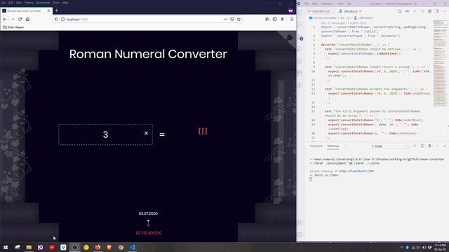

# Roman Numeral Converter

I've created a Roman Numeral Converter since I've wanted to start using ES6 modules in a project from start to finish and to practice testing my own code.

I've took the code that I've wrote for the _Roman Numeral Converter_ project, part of _JavaScript Algorithms and Data Structures Certification curriculum_ and I've also implemented an UI and added more functionality. You can check the live example [here](https://alexandracaulea.github.io/roman-converter/). For unit testing I've used [Jest](https://jestjs.io/).

## How To Use It

### Installation

1. Clone the repository: `git clone https://github.com/alexandracaulea/roman-converter.git`
2. Go to the project: `cd roman-converter`
3. Install project dependencies by running: `npm install`

### Using this repository

1. For the development run: `npm run dev`
2. To build run: `npm run build`
3. To run tests: `npm run test`
4. To watch the tests: `npm run testWatch`

#### Live Example

[Live example on GitHub](https://alexandracaulea.github.io/roman-converter/)

#### Credit

1. [Pillar column](https://pixabay.com/vectors/pillar-column-vine-greek-roman-29655/) by [Clker-Free-Vector-Images](https://pixabay.com/users/clker-free-vector-images-3736/).

2. [Day Roman Font](https://www.dafont.com/day-roman.font) by [ Apostrophic Labs](https://www.dafont.com/apostrophic-labs.d128).
